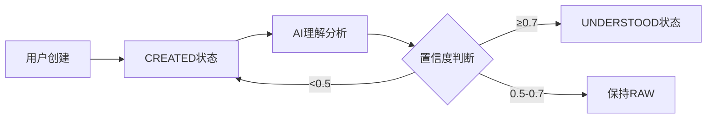
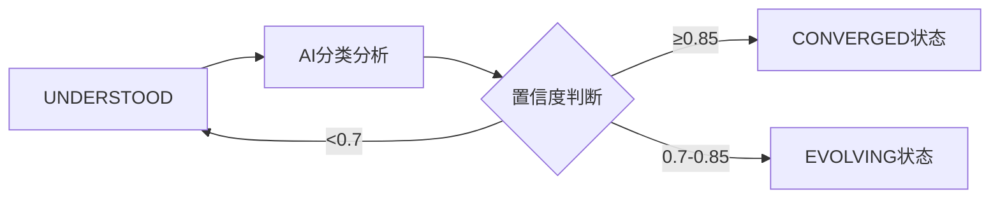

# Almond Backend Service

> 智能想法管理系统 - AI驱动的想法自动演化平台

[](https://openjdk.java.net/)
[](https://spring.io/projects/spring-boot)
[](LICENSE)
[](https://github.com/yourusername/almond-back/actions)

## 目录

- [项目简介](#项目简介)
- [核心特性](#核心特性)
- [系统架构](#系统架构)
- [技术栈](#技术栈)
- [快速开始](#快速开始)
- [API文档](#api文档)
- [业务逻辑](#业务逻辑)
- [开发指南](#开发指南)
- [测试](#测试)
- [部署](#部署)
- [贡献指南](#贡献指南)

## 项目简介

Almond Backend Service（小杏仁后端服务）是一个**AI驱动的智能想法管理系统**，旨在帮助用户将碎片化的想法自动转化为可执行的任务、目标或有价值的知识。

### 核心理念

```
用户随手记录想法 → AI自动理解和澄清 → AI智能分类和演化 → 最终收敛为可执行项
```

系统通过AI能力，将用户的原始输入（可能是模糊的、碎片化的想法）自动处理成结构化的、可执行的信息，减少用户的认知负担，提升生产力。

## 核心特性

### 🤖 AI驱动的自动化处理

- **智能理解**: AI自动提取想法的核心意图，生成标题和澄清内容
- **自动分类**: 基于内容语义，自动识别想法类型（记忆/行动/目标等）
- **置信度评估**: 每次AI分析都包含置信度评分，确保准确性

### 📊 完整的想法生命周期管理

想法状态流转：
```
RAW (原始)
  ↓ AI理解 (置信度≥0.7)
UNDERSTOOD (已澄清)
  ↓ AI分类 (置信度≥0.85)
EVOLVING (演化中)
  ↓ 内容稳定
CONVERGED (已收敛)
  ↓ 用户确认完成
ARCHIVED (归档)
```

### 🎯 七种想法最终类型

- **MEMORY** (记忆): 需要被记住的信息
- **ACTION** (行动): 需要执行的具体事项
- **GOAL** (目标): 长期或阶段性目标
- **DECISION** (决策): 需要权衡选项的事项
- **REVIEW** (复盘): 总结、反思与提炼
- **REFERENCE** (参考): 有价值的资料型内容
- **DISCARD** (放弃): 无价值或暂不处理的想法

### 📋 强大的列表查询功能

- **多维度筛选**: 按状态、类型、星标、关键词等筛选
- **灵活排序**: 支持按更新时间、创建时间、成熟度评分排序
- **统计信息**: 实时统计各状态、类型的数量分布
- **分页支持**: 高效的分页查询机制

### 🔍 完善的审计追踪

- **状态变更日志**: 记录每次状态流转的触发者和原因
- **AI分析快照**: 保存每次AI分析的完整结果
- **自动化日志**: 追踪所有自动化操作

### 🏷️ 灵活的标签系统

- 支持认知标签、主题标签等多种类型
- 标签与想法的多对多关联
- 标签继承和演化机制

## 系统架构

### 模块结构

```
almond-back/
├── almond-back-api/          # API接口定义层
│   ├── enums/                # 枚举定义
│   ├── request/              # 请求模型
│   └── response/             # 响应模型
├── almond-back-service/      # 业务逻辑实现层
│   ├── dao/                  # 数据访问层
│   ├── entity/               # 实体类
│   ├── service/              # 服务接口
│   ├── service/impl/         # 服务实现
│   ├── ai/                   # AI服务集成
│   ├── sdk/                  # 外部SDK
│   └── resources/mappings/   # MyBatis映射文件
├── almond-back-web/          # Web控制器层
│   └── controller/           # REST API控制器
└── almond-back-start/        # 启动模块
    ├── config/               # 配置类
    └── AlmondApplication.java # 主启动类
```

### 分层架构

```
┌─────────────────────────────────────┐
│       Controller Layer              │  RESTful API
├─────────────────────────────────────┤
│       Service Layer                 │  业务逻辑
├─────────────────────────────────────┤
│       DAO Layer                     │  数据访问
├─────────────────────────────────────┤
│       Database (MySQL)              │  数据持久化
└─────────────────────────────────────┘

        ↕️ (异步调用)

┌─────────────────────────────────────┐
│       AI Center Service             │  AI能力服务
└─────────────────────────────────────┘
```

### 核心数据模型

**9张核心数据表**:

1. `almond_item` - 杏仁核心表
2. `almond_state_log` - 状态变更日志
3. `almond_ai_snapshot` - AI分析快照
4. `almond_tag` - 标签表
5. `almond_tag_relation` - 标签关联表
6. `action_execution` - 行动执行记录
7. `memory_aids` - 记忆辅助
8. `review` - 复盘记录
9. `review_schedule` - 复习计划

## 技术栈

### 核心框架

- **Java**: 17 (LTS)
- **Spring Boot**: 3.2.6
- **Spring Cloud**: Alibaba (Nacos)
- **MyBatis Plus**: 3.x (增强版ORM框架)

### 数据存储

- **数据库**: MySQL 8.x
- **缓存**: Redis (Lettuce连接池)
- **连接池**: HikariCP

### 微服务组件

- **Nacos Discovery**: 服务注册与发现
- **Nacos Config**: 动态配置管理
- **OpenFeign**: 声明式HTTP客户端

### 开发工具

- **Lombok**: 简化Java代码
- **FastJSON**: JSON序列化
- **MapStruct**: 对象映射
- **Knife4j**: API文档 (OpenAPI 3.0)

### 测试框架

- **JUnit 5**: 单元测试框架
- **Mockito**: Mock框架
- **Spring Test**: 集成测试支持
- **JaCoCo**: 代码覆盖率工具（强制80%覆盖率）

### 监控与日志

- **Spring Actuator**: 健康检查和监控
- **Prometheus**: 指标收集
- **Logstash Logback Encoder**: 日志结构化

### CI/CD

- **GitHub Actions**: 自动化测试和构建
- **Docker**: 容器化部署
- **Docker Compose**: 本地开发环境编排

## 快速开始

### 前置要求

- Java 17+
- Maven 3.6+
- MySQL 8.0+
- Redis 6.0+
- Docker (可选，用于容器化部署)

### 环境配置

1. **克隆项目**

```bash
git clone https://github.com/yourusername/almond-back.git
cd almond-back
```

2. **配置Nacos**

确保Nacos服务已启动，并在Nacos配置中心创建以下配置：

- **Data ID**: `common.yml`
- **Group**: `DEFAULT_GROUP`
- **配置内容**:

```yaml
common:
  mysql:
    url: localhost
    username: your_username
    password: your_password
  redis:
    host: localhost
    port: 6379
```

3. **配置数据库**

执行数据库初始化脚本（假设你有SQL脚本）:

```bash
mysql -u root -p < database/init.sql
```

4. **配置AI Center地址**

在 `application-dev.yml` 中配置AI Center服务地址：

```yaml
almond:
  ai-center:
    url: http://localhost:8000  # AI Center服务地址
```

### 本地运行

#### 方式一：Maven运行

```bash
mvn clean install
cd almond-back-start
mvn spring-boot:run -Dspring.profiles.active=dev
```

#### 方式二：Docker Compose运行

```bash
docker-compose up -d
```

服务启动后，访问以下地址：

- **应用服务**: http://localhost:8082
- **API文档**: http://localhost:8082/doc.html
- **健康检查**: http://localhost:10081/actuator/health

## API文档

### 核心接口

#### 1. 创建杏仁

```http
POST /front/almonds/create
Content-Type: application/json

{
  "content": "明天要完成项目报告"
}
```

**响应**:
```json
{
  "code": 0,
  "message": "success",
  "data": {
    "id": 123,
    "content": "明天要完成项目报告",
    "almondStatus": "raw",
    "evolutionStage": "created"
  }
}
```

#### 2. 查询杏仁列表

```http
POST /front/almonds/list
Content-Type: application/json

{
  "pageNum": 1,
  "pageSize": 20,
  "almondStatus": "understood",
  "finalType": "action",
  "starred": 0,
  "keyword": "项目",
  "sortBy": "update_time",
  "sortOrder": "desc"
}
```

**响应**:
```json
{
  "code": 0,
  "message": "success",
  "data": {
    "total": 50,
    "list": [
      {
        "id": 123,
        "title": "完成项目报告",
        "content": "明天要完成项目报告",
        "almondStatus": "understood",
        "finalType": "action",
        "maturityScore": 75,
        "tags": ["工作", "项目"]
      }
    ],
    "statistics": {
      "statusCount": {
        "raw": 10,
        "understood": 20,
        "evolving": 15,
        "converged": 5
      },
      "typeCount": {
        "action": 25,
        "memory": 15,
        "goal": 10
      },
      "starredCount": 8,
      "totalCount": 50
    }
  }
}
```

#### 3. 获取杏仁详情

```http
GET /front/almonds/{id}
```

**简单详情响应**:
```json
{
  "code": 0,
  "message": "success",
  "data": {
    "id": 123,
    "title": "完成项目报告",
    "content": "明天要完成项目报告",
    "clarifiedContent": "需要在明天下班前完成Q4项目总结报告",
    "almondStatus": "understood",
    "evolutionStage": "understood",
    "finalType": "action",
    "maturityScore": 75,
    "tags": ["工作", "项目"]
  }
}
```

#### 4. 获取杏仁完整详情

```http
GET /front/almonds/{id}/detail
```

**完整详情响应**（包含标签详情、状态日志、AI快照等）

### 更多API文档

启动服务后访问 Knife4j 文档界面获取完整API文档：

http://localhost:8082/doc.html

## 业务逻辑

### 想法演化流程

#### 阶段1: 创建与AI理解



**AI理解服务** (`AlmondUnderstandingAiService`):
- **触发**: 创建杏仁后异步执行
- **功能**: 提取标题、澄清内容、生成初始标签
- **置信度阈值**: 0.7

#### 阶段2: AI分类



**AI分类服务** (`AlmondClassificationService`):
- **触发**: UNDERSTOOD状态后延迟触发
- **功能**: 识别最终类型、计算成熟度评分
- **置信度阈值**: 0.85 (自动收敛)

#### 阶段3: 用户确认与归档

- **CONVERGED**: 用户可手动标记为完成
- **ARCHIVED**: 已完成或不再需要的想法归档

### 状态机设计

系统维护两套状态体系：

**用户可见状态** (`AlmondStatus`):
- RAW, UNDERSTOOD, EVOLVING, CONVERGED, ARCHIVED

**内部演化阶段** (`EvolutionStage`):
- CREATED, UNDERSTANDING, UNDERSTOOD, CLASSIFYING, CLASSIFIED, CONVERGED, TYPE_PROCESSING, COMPLETED, ARCHIVED

状态机服务 (`AlmondStateMachineService`) 确保状态流转的一致性和可追溯性。

### AI集成架构

```
┌─────────────────┐
│  Almond Service │
└────────┬────────┘
         │ 异步调用
         ↓
┌─────────────────┐
│  AI Services    │
│  - Understanding│
│  - Classification
└────────┬────────┘
         │ HTTP POST
         ↓
┌─────────────────┐
│  AI Center SDK  │
└────────┬────────┘
         │
         ↓
┌─────────────────┐
│ AI Center API   │
│ (External)      │
└─────────────────┘
```

### 用户画像系统

AI分类时会构建用户画像，包括：
- 历史想法的类型分布
- 常用标签和主题
- 行为偏好

这些信息用于提供个性化的AI分析结果。

## 开发指南

### 项目结构说明

```
src/main/java/com/ravey/almond/
├── api/                        # API定义模块
│   ├── enums/                  # 枚举类
│   │   ├── AlmondStatus.java  # 杏仁状态枚举
│   │   ├── FinalType.java     # 最终类型枚举
│   │   └── EvolutionStageType.java  # 演化阶段枚举
│   ├── request/                # 请求DTO
│   └── response/               # 响应DTO
├── service/                    # 业务逻辑模块
│   ├── ai/                     # AI服务
│   │   ├── AlmondUnderstandingAiService.java
│   │   └── AlmondClassificationService.java
│   ├── sdk/                    # 外部SDK
│   │   └── aicenter/           # AI Center SDK
│   ├── service/                # 服务接口
│   │   ├── AlmondService.java
│   │   └── AlmondStateMachineService.java
│   └── service/impl/           # 服务实现
└── web/                        # Web模块
    └── controller/             # 控制器
        └── AlmondController.java
```

### 添加新功能

#### 示例: 添加新的想法类型

1. **定义枚举** (`FinalType.java`):

```java
public enum FinalType {
    // ...existing types
    NEW_TYPE("new_type", "新类型", "新类型的描述");

    // constructor and methods...
}
```

2. **创建数据表** (如果需要特定表):

```sql
CREATE TABLE new_type_data (
    id BIGINT PRIMARY KEY AUTO_INCREMENT,
    almond_id BIGINT NOT NULL,
    -- specific fields
    FOREIGN KEY (almond_id) REFERENCES almond_item(id)
);
```

3. **添加Service处理逻辑**:

```java
public class NewTypeService {
    public void processNewType(Long almondId) {
        // implementation
    }
}
```

4. **更新AI分类逻辑** (如需要)

### 代码规范

- 遵循阿里巴巴Java开发手册
- 使用Lombok减少样板代码
- Service层方法必须添加 `@Transactional` 注解
- 所有public方法必须添加Javadoc注释
- 变量命名使用驼峰命名法

### 日志规范

```java
// 使用SLF4J
@Slf4j
public class AlmondServiceImpl {

    public void method() {
        log.info("处理杏仁, id={}", almondId);
        log.warn("AI置信度较低, confidence={}", confidence);
        log.error("处理失败", exception);
    }
}
```

## 测试

### 运行测试

```bash
# 运行所有测试
mvn test

# 运行特定测试类
mvn test -Dtest=AlmondServiceImplTest

# 运行测试并生成覆盖率报告
mvn verify
```

### 查看覆盖率报告

```bash
# 报告位置
open almond-back-service/target/site/jacoco/index.html
```

### 测试覆盖率要求

项目强制要求测试覆盖率达到 **80%**，否则构建失败。

### 测试示例

```java
@SpringBootTest
class AlmondServiceImplTest {

    @Mock
    private AlmondMapper almondMapper;

    @InjectMocks
    private AlmondServiceImpl almondService;

    @Test
    void testCreateAlmond() {
        CreateAlmondReq req = new CreateAlmondReq();
        req.setContent("测试内容");

        AlmondItemResp resp = almondService.createAlmond(req);

        assertNotNull(resp);
        assertEquals("测试内容", resp.getContent());
        assertEquals(AlmondStatus.RAW, resp.getAlmondStatus());
    }
}
```

## 部署

### Docker部署

#### 1. 构建镜像

```bash
# 构建项目
mvn clean package -DskipTests

# 构建Docker镜像
docker build -t almond-back:latest .
```

#### 2. 运行容器

```bash
docker run -d \
  --name almond-back \
  -p 8082:8082 \
  -p 10081:10081 \
  -e SPRING_PROFILES_ACTIVE=prod \
  -e ALMOND_AI_CENTER_URL=http://ai-center:8000 \
  almond-back:latest
```

### Docker Compose部署

```bash
# 启动所有服务
docker-compose up -d

# 查看日志
docker-compose logs -f almond-back

# 停止服务
docker-compose down
```

### 生产环境配置

#### application-prod.yml

```yaml
spring:
  datasource:
    url: jdbc:mysql://prod-mysql-host:3306/almond?useSSL=true
    username: ${DB_USERNAME}
    password: ${DB_PASSWORD}
    hikari:
      maximum-pool-size: 20
      minimum-idle: 5

  data:
    redis:
      host: ${REDIS_HOST}
      port: 6379
      password: ${REDIS_PASSWORD}

  cloud:
    nacos:
      discovery:
        server-addr: ${NACOS_SERVER}
        namespace: ${NACOS_NAMESPACE}

logging:
  level:
    root: INFO
    com.ravey.almond: INFO
  file:
    name: /var/log/almond/application.log

management:
  endpoints:
    web:
      exposure:
        include: health,prometheus
```

### 健康检查

```bash
# 应用健康检查
curl http://localhost:10081/actuator/health

# Prometheus指标
curl http://localhost:10081/actuator/prometheus
```

### 性能优化建议

1. **数据库优化**:
   - 为常用查询字段添加索引
   - 使用连接池优化连接管理
   - 定期清理历史日志数据

2. **缓存策略**:
   - 对频繁查询的杏仁详情进行缓存
   - 使用Redis缓存用户画像数据

3. **异步处理**:
   - AI调用使用异步执行，避免阻塞主线程
   - 使用消息队列处理批量操作

## 贡献指南

我们欢迎所有形式的贡献！

### 提交Issue

- 使用清晰的标题描述问题
- 提供复现步骤
- 包含错误日志和截图

### 提交Pull Request

1. Fork本项目
2. 创建特性分支 (`git checkout -b feature/AmazingFeature`)
3. 提交更改 (`git commit -m 'Add some AmazingFeature'`)
4. 推送到分支 (`git push origin feature/AmazingFeature`)
5. 创建Pull Request

### 提交规范

遵循Conventional Commits规范：

```
feat: 添加新功能
fix: 修复bug
docs: 文档更新
test: 测试相关
refactor: 重构代码
perf: 性能优化
chore: 构建/工具链更新
```

## 许可证

本项目采用 MIT 许可证 - 详见 [LICENSE](LICENSE) 文件

## 联系方式

- **作者**: RaveyShare Team
- **邮箱**: support@ravey.com
- **项目主页**: https://github.com/yourusername/almond-back

## 致谢

感谢所有为本项目做出贡献的开发者！

---

**Happy Coding! 🎉**
